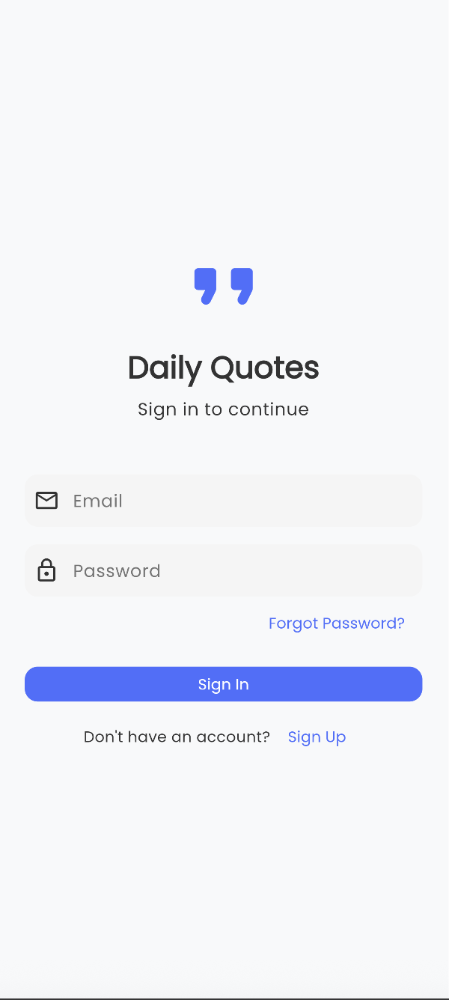
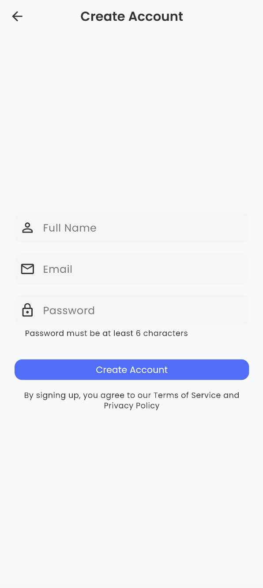
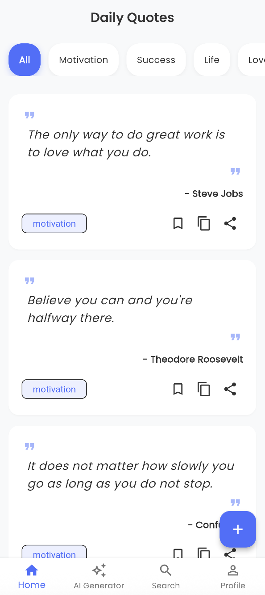
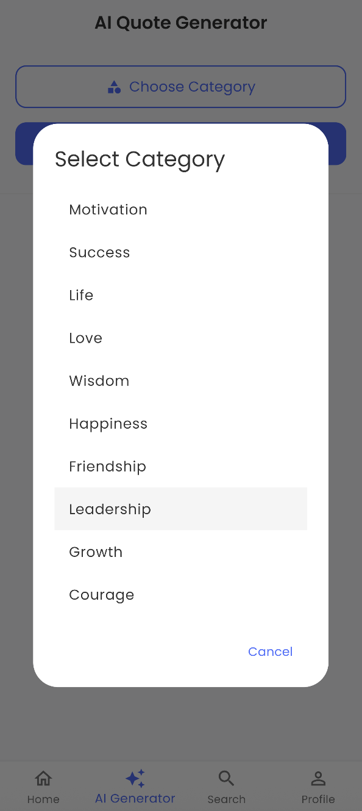
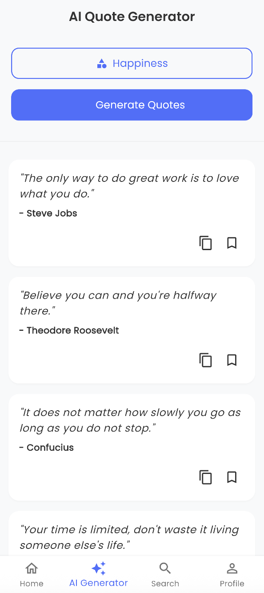
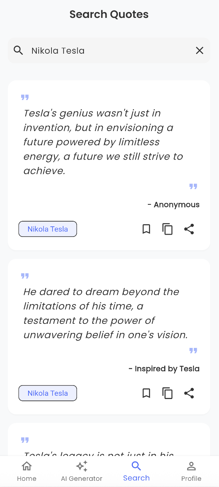
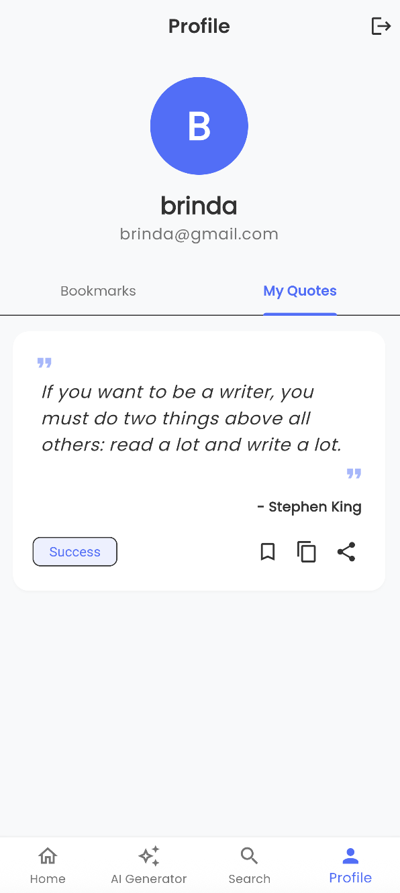
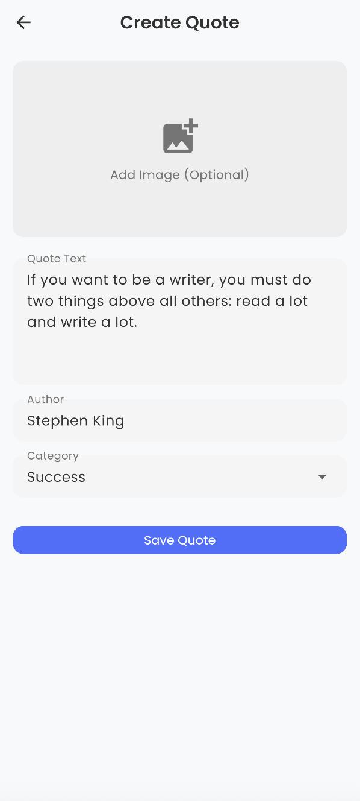

# 📱 Flutter Quotes App

A beautiful and minimal **Flutter Quotes App** that displays inspirational and motivational quotes. Designed with clean UI and efficient navigation to help uplift your day, one quote at a time.


## ✨ Overview

This Flutter app features AI-powered quote generation across various categories. Users can effortlessly search for quotes, create their own, and share them with others. Designed with a clean and responsive interface, it delivers a seamless experience on both Android and iOS — offering daily motivation and inspiration at your fingertips.


## 🚀 Features

- 🤖 AI-Generated Quotes by Category: Generate quotes tailored to various themes.
- 🗂️ Categories Include: Motivation, Success, Life, Love, Wisdom, Happiness, and more.
- 📖 Random Quote Display: View a fresh quote each time you open the app.
- 🔄 Quick Quote Refresh: Tap to instantly get a new set of quotes.
- 🔎 Effortless Quote Search: Easily search for any quote or topic of your choice.
- 📤 Simple Sharing: Share your favorite quotes with friends and family effortlessly.
- 🎯 Clean, Intuitive UI: Enjoy a sleek and easy-to-navigate interface.


## 🛠️ Tech Stack

<p align="left">
  
  
</p>


## 📸 Screenshots

<kbd align="left">
  
  
  
  
  
  
  
  
  
  
</kbd>

## 📦 Installation

### 🔧 Prerequisites

- [Flutter SDK](https://flutter.dev/docs/get-started/install)
- Android Studio / VS Code / Xcode

### 🚀 Steps

1. **Clone the repository**
   ```bash
   git clone https://github.com/Brinda1750/Flutter_Quotes_App.git
   cd Flutter_Quotes_App

2. **Get Flutter dependencies**
   ```bash
   flutter pub get

3. **Run the app**
   ```bash
   flutter run


## 🧠 AI Chatbot (Google Gemini) Setup:

To use the **Gemini AI Chatbot** feature, you need to provide your own API key.  
Create an API key by visiting [Google AI Studio](https://aistudio.google.com/app/apikey).


## 🤝 Contributing

Contributions are always welcome!

To contribute:
1. Fork the repo  
2. Create your feature branch (`git checkout -b feature-name`)  
3. Commit your changes (`git commit -m 'Add feature'`)  
4. Push to the branch (`git push origin feature-name`)  
5. Open a pull request  


## 👩‍💻 Author

- **Brinda** – [@Brinda1750](https://github.com/Brinda1750)


## 🔗 Useful Links

- [Flutter Documentation](https://flutter.dev/docs)  
- [Dart Language](https://dart.dev/guides)