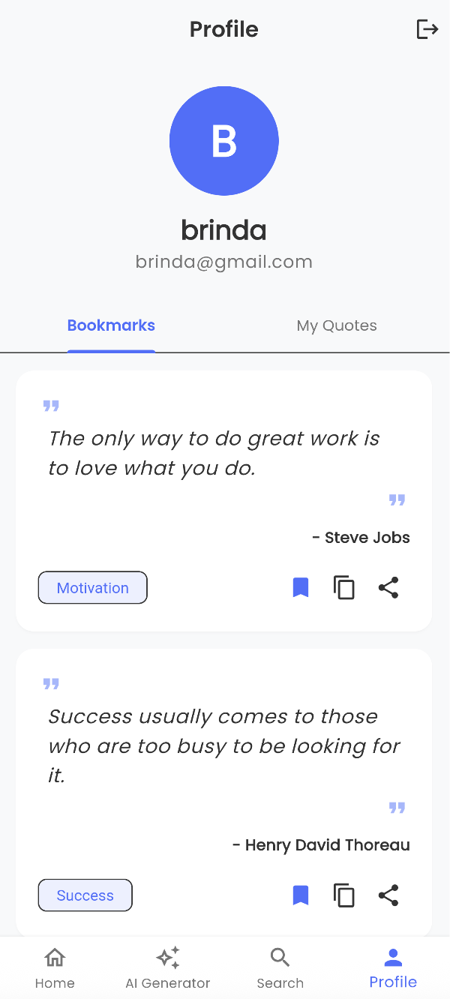

# 📱 Flutter Quotes App

This Flutter app features AI-powered quote generation across various categories. Users can effortlessly search for quotes, create their own, and share them with others. Designed with a clean and responsive interface, it delivers a seamless experience on both Android and iOS — offering daily motivation and inspiration at your fingertips.


## ✨ Overview

This Flutter app offers a collection of inspirational quotes, allowing users to generate personalized quotes using AI based on different categories. Users can easily search for new quotes, create their own, and share them with others. With a clean and responsive design, the app ensures a smooth experience on both Android and iOS devices, providing a quick source of motivation and inspiration whenever needed.


## 🛠️ System Architecture

```
quotes_app/
├── lib/
│   ├── api/
│   │   └── google_gemini_service.dart    # AI service to interact with Google Gemini API
│   ├── models/
│   │   ├── quote.dart                   # Model representing a quote
│   │   └── category.dart                # Model representing a quote category
│   ├── screens/
│   │   ├── home_screen.dart             # Home screen displaying random quotes
│   │   ├── generate_screen.dart         # Screen for generating AI-powered quotes
│   │   ├── favorites_screen.dart        # Screen for displaying saved quotes
│   │   └── search_screen.dart           # Screen for searching quotes
│   ├── widgets/
│   │   ├── quote_card.dart              # Reusable UI widget for displaying quotes
│   │   └── category_tile.dart           # UI widget for category selection
│   ├── services/
│   │   ├── storage_service.dart         # Service for managing local storage (bookmarks)
│   │   └── share_service.dart           # Service for sharing quotes
│   ├── utils/
│   │   ├── constants.dart              # Constants like API keys, app settings
│   │   └── helpers.dart                # Helper functions used across the app
│   └── main.dart                        # Entry point of the app
├── assets/
│   ├── fonts/                          # Custom fonts used in the app
│   └── images/                         # App images and icons
├── pubspec.yaml                        # Flutter dependencies and settings
└── README.md                           # Project documentation

```


## 🚀 Features

- 🤖 AI-Generated Quotes by Category: Generate quotes tailored to various themes.
- 🗂️ Categories Include: Motivation, Success, Life, Love, Wisdom, Happiness, and more.
- 📖 Random Quote Display: View a fresh quote each time you open the app.
- 🔄 Quick Quote Refresh: Tap to instantly get a new set of quotes.
- 🔎 Effortless Quote Search: Easily search for any quote or topic of your choice.
- 📤 Simple Sharing: Share your favorite quotes with friends and family effortlessly.
- 🎯 Clean, Intuitive UI: Enjoy a sleek and easy-to-navigate interface.
- 📒 Bookmark your favorite quotes to read later.


## 🛠️ Tech Stack

<p align="left">
  
  
</p>


## 📸 Screenshots

<kbd align="left">
  
  
  
  
  
  
  
  
  
  
</kbd>

## 📦 Installation

### 🔧 Prerequisites

- [Flutter SDK](https://flutter.dev/docs/get-started/install)
- Android Studio / VS Code / Xcode

### 🚀 Steps

1. **Clone the repository**
   ```bash
   git clone https://github.com/Brinda1750/Flutter_Quotes_App.git
   cd Flutter_Quotes_App

2. **Get Flutter dependencies**
   ```bash
   flutter pub get

3. **Run the app**
   ```bash
   flutter run


## 🧠 AI Chatbot (Google Gemini) Setup:

To use the **Gemini AI Chatbot** feature, you need to provide your own API key.  
Create an API key by visiting [Google AI Studio](https://aistudio.google.com/app/apikey).


## 🤝 Contributing

Contributions are always welcome!

To contribute:
1. Fork the repo  
2. Create your feature branch (`git checkout -b feature-name`)  
3. Commit your changes (`git commit -m 'Add feature'`)  
4. Push to the branch (`git push origin feature-name`)  
5. Open a pull request  


## 🔮 Future Work

- 🔐 User Authentication: Integrate Firebase Auth for personalized profiles.
- ☁️ Cloud Sync: Save bookmarks and custom quotes to Firestore.
- 📅 Daily Notifications: Schedule daily motivational quotes.
- 🌐 Localization: Support multiple languages.
- 🖌️ Theming: Add light/dark mode and custom themes.
- 📊 Analytics: Track popular quotes and user engagement.


## 👩‍💻 Author

- **Brinda** – [@Brinda1750](https://github.com/Brinda1750)


## 🔗 Useful Links

- [Flutter Documentation](https://flutter.dev/docs)  
- [Dart Language](https://dart.dev/guides)